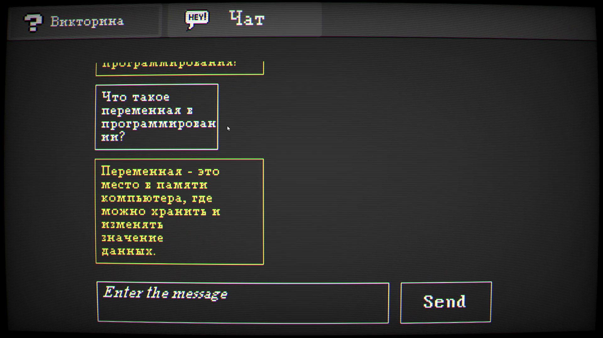

# MIST
Game created for a 3 day game hackathon. This game goal is to teach a player about programming languages through interactive gameplay and interesting storyline. 
This game features:

### Great Atmosphere
This game has a sort of spooky forest feel to it. This way we intend to attract more young audeience to start learning programming languages
.png)

### Mini quizess

### Ingame ChatGPT helper

### Sandbox puzzles

